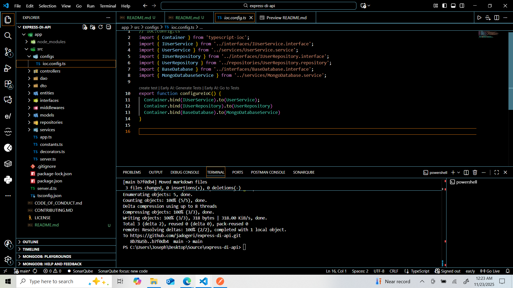
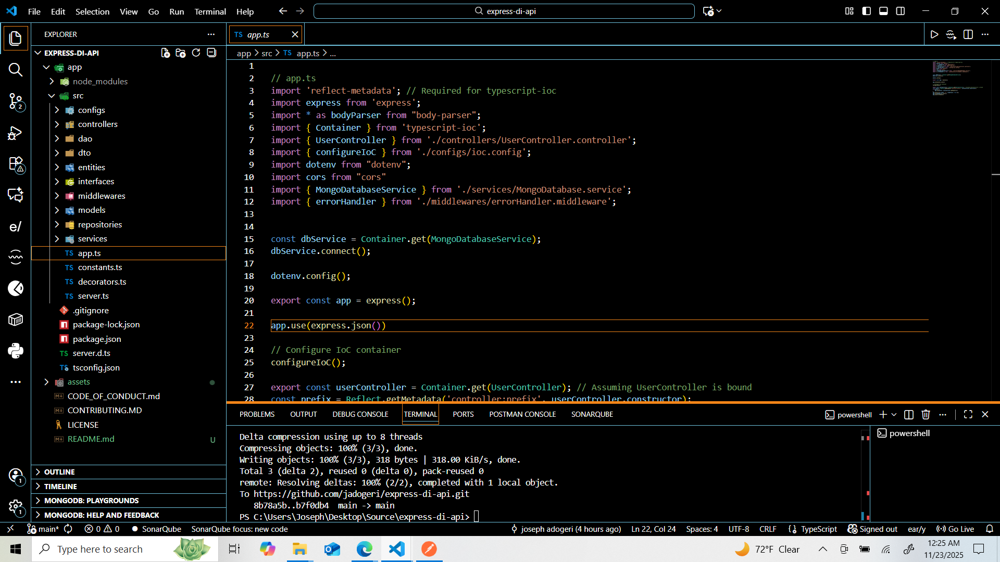
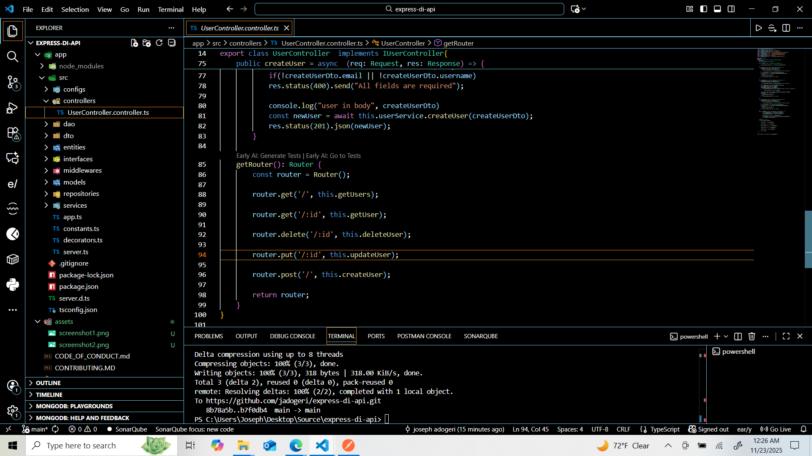
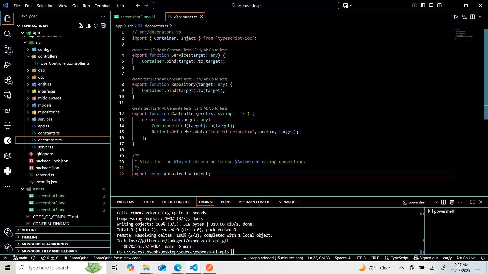

## **Express DI API**

**Version:** 1.10.0
**Date:** November 23, 2025

---

## Description

This is a backend Application temnplate implemting inversion of control, dependency injection using typescript-ioc.

## Authors

- [@jadogeri](https://www.github.com/jadogeri)

## Repository

- [source code ](https://github.com/jadogeri/express-di-api.git)

## Screenshots

---

|  |  |
| -------------------------------------------- | -------------------------------------------- |
|  |  |

## Table of Contents

<ul>
    <li><a href="#1-introduction">1. Introduction</a>
      <ul>
        <li><a href="#11-purpose">1.1 Purpose</a> </li>
      </ul>
    </li>
    <li><a href="#2-installation">2. Installation</a>  </li>
    <li><a href="#3-usage">3. Usage</a>
      <ul>
          <li><a href="#31-run-application">3.1 Run Application</a> </li>
          <ul>
            <li><a href="#311-run-locally">3.1.1 Run Locally</a> </li>
          </ul>
      </ul>
    </li>
    <li><a href="#4-api-documentation">4. API Documentation</a> </li>
    <li><a href="#5-references">5. References</a> </li>
</ul>

## **1. Introduction**

### **1.1 Purpose**

This document outlines the components, and design considerations for functionality to express application.

## **2. Installation**

* [Download and install NodeJS](https://nodejs.org/en/download)

---

## **3. Usage**

**Prerequisites** :installation of NodeJS.

### **3.1 Run Application**

1 Open command prompt or terminal.

2 Type command git clone https://github.com/jadogeri/express-di-api.git then press enter.

```bash
  git clone https://github.com/jadogeri/express-di-api.git
```

3 Enter command cd express-di-api/app then press enter.

```bash
  cd express-di-api/app
```

#### **3.1.1 Run Locally**

1 Type npm install --force to install dependencies.

```bash
  npm install --force
```

2 Type npm start to run application

```bash
  npm start
```
---

#### 4 API Documentation ####

| Method        | Description    | Endpoint                                        | Body      | Param       |
| ----------- | ------ | -------------------------------------------------- | ------------------------ |------------------------ |
| `GET`       | Returns all users | `http:localhost:4000/users/` | none       |   none          |             
| `GET` | Return single user | `http:localhost:4000/users/:id` | none  |  id e.g `69228e6b8f9f98a7327b2d7a` |   
| `POST`   | Creates a user | `http:localhost:4000/users/` | e.g `{"username": "john doe", "email":"johndoe@gmail.com"}`    | none |                      
| `PUT`| Updates a user | `http:localhost:4000/users/:id` | e.g `{"username": "john doe", "email":"johndoe@gmail.com"}` |  id e.g `69228e6b8f9f98a7327b2d7c`    |  
| `DELETE`| Removes a user |`http:localhost:4000/users/:id`  | none  | id e.g `69228e6b8f9f98a7327b2d7b`    |     


## **5. References**
* npm : [IoC Container for Typescript - 3.X)](https://www.npmjs.com/package/typescript-ioc).
* FreeCodeCamp : [Frontend Web Development: (HTML, CSS, JavaScript, TypeScript, React)](https://www.youtube.com/watch?v=MsnQ5uepIa).
* AweSome Open Source : [Awesome Readme Templates](https://awesomeopensource.com/project/elangosundar/awesome-README-templates)
* Readme.so : [The easiest way to create a README](https://readme.so/)
* HUXN Webdev : [Master ReactJS in 7 Hours with 10 Real-World Projects 2023](https://www.youtube.com/watch?v=XrwsMN2IWnE/)
* Dave Gray : [React JS Full Course for Beginners | Complete All-in-One Tutorial | 9 Hours](https://www.youtube.com/watch?v=RVFAyFWO4go/)
* Dipesh Malvia : [Learn React JS with Project in 2 Hours | React Tutorial for Beginners | React Project Crash Course](https://www.youtube.com/watch?v=0riHps91AzE/)


